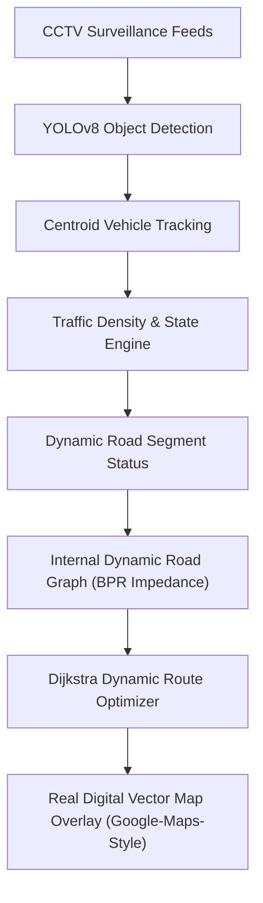
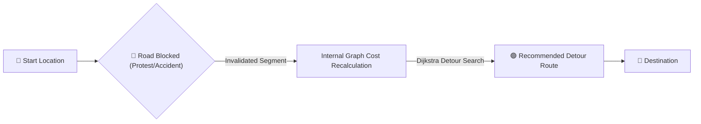

# 01. Project Vision

## 1. Executive Summary
**Crowd Flow** is an AI-based traffic and route management decision-support prototype that monitors urban road networks through CCTV video feeds, detects traffic bottlenecks, represents the road grid as an adaptive "jigsaw" graph, and simulates the ripple effects of road closures. When a road is compromised by protests, VIP movements, accidents, waterlogging, or severe congestion, Crowd Flow treats that road as a missing puzzle piece, recalculates alternative routes avoiding saturated links, simulates the redistribution of displaced vehicles, and recommends optimized traffic signal splits for traffic police operators.

## 2. Academic & Institutional Context
- **Institution:** Savitribai Phule Pune University (SPPU)
- **Degree:** Bachelor of Science in Computer Science (T.Y. B.Sc. CS)
- **Course Code:** CS-331-FP (Project Work)
- **Academic Year:** 2025–2026 / 2026–2027
- **Project Team:**
  - Tanish Dhende (Roll No. 98)
  - Palavi Jadhav (Roll No. 108)

## 3. Core Philosophy: Real Digital Map UI & Internal Dynamic Graph Engine
Traditional navigation applications treat road navigation from an egocentric point of view: finding the fastest path for a single driver without considering systemic capacity constraints. When a major arterial corridor closes, naive rerouting dumps thousands of vehicles onto narrow residential feeder roads, causing secondary gridlock.

Crowd Flow decouples **internal graph algorithmic processing** from **user-facing map visualization**:

### Map Layer & User Interface (Google-Maps-Like Experience)
The operator and driver interface displays a **real digital road map**, overlaying live traffic intelligence:
- 🟢 **Green Road:** Normal / Recommended route corridor.
- 🟡 **Yellow Road:** Slow traffic flow.
- 🔴 **Red Road:** Congested bottleneck corridor.
- ⚫ **Black Road / 🚧:** Blocked segment (protest, accident, waterlogging, or VIP closure).
- 📍 **Start & Destination Markers:** Origin and destination junction nodes.
- ➡️ **Highlighted Route:** Clear visual path overlay showing the optimal detour route.

### Internal Graph Engine Mechanics
Internally, the backend models the network topology as a directed graph $G=(V, E)$ with BPR (Bureau of Public Roads) dynamic impedance functions:
1. **Nodes (Intersections):** Fixed vertices where traffic splits or converges.
2. **Edges (Road Segments):** Dynamic graph edges with finite physical vehicle capacities, flow rates, and BPR impedance penalties.
3. **Disruption Handling:** When a segment is blocked, its capacity drops to zero and cost approaches infinity, forcing Dijkstra/A* pathfinding algorithms to select alternate corridors.
4. **Traffic Redistribution:** Volume displaced from blocked roads is modeled across remaining corridors using logit choice functions.
5. **Advisory Rebalancing:** Advisory signal timing plans (Webster equisaturation) extend green phases along active detour corridors.

## 4. Key Distinctions
| Feature | Generic CCTV Project | Standard Navigation App | Crowd Flow Academic System |
| :--- | :--- | :--- | :--- |
| **Primary Goal** | Count vehicles in a frame | Reroute single vehicle | Network-wide traffic balance & decision support |
| **AI Role** | Object detection bounding boxes | GPS probe aggregation | Spatial-temporal tracking, queue persistence, road state classification |
| **UI Presentation** | Raw video player with boxes | Standard consumer map | **Google-Maps-Like Digital Vector Map** with real-time status overlays & HUD drawer |
| **Graph Dynamics** | Static or nonexistent | Commercial proprietary API | Explicit directed graph with real-time capacity-impedance functions |
| **Disruption Handling** | None | Reactive rerouting | Proactive "What-If" redistribution simulation |
| **Signal Control** | None | None | Capacity-aware advisory signal phase splits |

## 5. System Statement
> "Crowd Flow converts CCTV observations into real-time traffic intelligence. It detects and tracks vehicles, extracts movement and queue features, determines the state of individual roads, and updates an internal dynamic road graph. When a road becomes blocked or overloaded, the system recalculates optimal detour routes, simulates traffic redistribution across remaining corridors, and draws the newly recommended route on a real digital road map alongside advisory traffic signal recommendations."\n