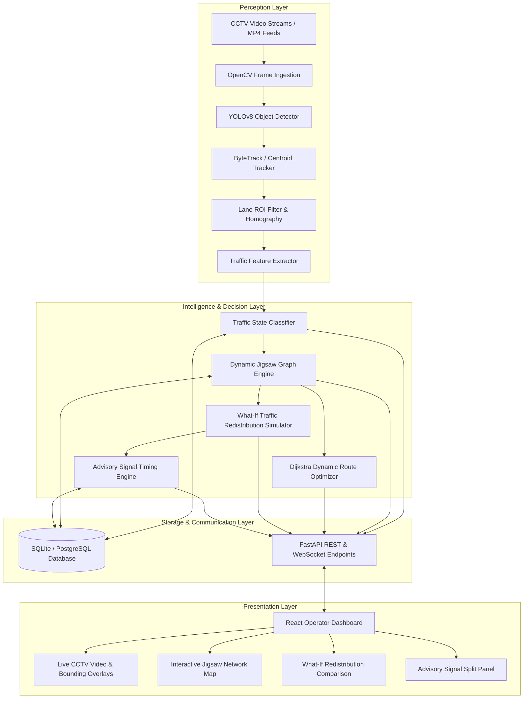

# 06. Tech Stack and Architecture

## 1. Architectural Philosophy
Crowd Flow follows a **Modular Clean Architecture** pattern designed to separate computer vision perception from higher-level graph algorithms and user interfaces. This decoupling ensures that edge camera failures or model updates do not disrupt graph routing or operator dashboard functionality.

## 2. High-Level Architectural Diagram

## 3. Technology Selection Rationale

| Layer | Chosen Technology | Alternatives Considered | Selection Justification |
| :--- | :--- | :--- | :--- |
| **Object Detection** | YOLOv8 Nano (`yolov8n`) | Faster R-CNN, SSD, YOLOv5 | Ultra-lightweight (3.2M params), excellent CPU inference speeds (~30-50ms), native PyTorch/ONNX support. |
| **Tracking** | ByteTrack / IoU Centroid | DeepSORT, StrongSORT | ByteTrack retains low-confidence detections from occluded vehicles without requiring heavy secondary feature extraction CNNs. |
| **Backend Framework**| FastAPI (Python 3.12) | Django, Flask, Express.js | Async capability, native Pydantic validation, auto-generated OpenAPI documentation, fast execution. |
| **Graph Operations** | Custom Python Engine + NetworkX | Neo4j, pgRouting | In-memory graph operations ensure sub-millisecond route recalculation without heavy database overhead. |
| **Database** | SQLite (dev) / PostgreSQL (prod)| MongoDB, Redis | ACID compliance for relational graph nodes, edges, logs, and zero-configuration portability for academic viva. |
| **Frontend** | React 18 + Modern CSS | Next.js, Vue, Angular | Modular component architecture, direct DOM control for custom SVG jigsaw map rendering, zero bloat. |\n