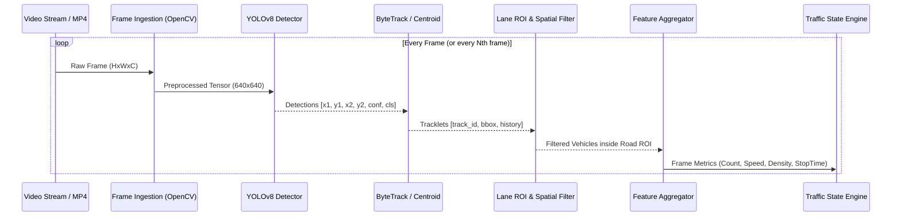

# 09. CCTV AI Pipeline

## 1. Perception Pipeline Overview
The CCTV AI Pipeline processes raw uncompressed video frames, identifies and tracks traffic participants, correlates pixel movement with physical road geometry, and outputs structured numerical observations.



## 2. Step-by-Step Processing Stages

### Stage 1: Frame Ingestion & Preprocessing
- Input: RTSP H.264 stream or local MP4 video file.
- Resizing: Scaled to input tensor dimensions ($640 \times 640$ pixels) maintaining aspect ratio with letterboxing.
- Frame Rate Management: Configurable inference skip rate (e.g., process 1 out of every 2 frames on low-tier i3 hardware to ensure real-time latency).

### Stage 2: Object Detection (YOLOv8)
- Model: Pretrained `yolov8n.pt` (COCO dataset weights).
- Filtered Classes:
  - Class 0: `person`
  - Class 2: `car`
  - Class 3: `motorcycle`
  - Class 5: `bus`
  - Class 7: `truck`
- Confidence Threshold: Default $\ge 0.35$ to eliminate noise while retaining distant vehicles.
- Non-Maximum Suppression (NMS) IoU Threshold: $0.45$.

### Stage 3: Multi-Object Tracking
- Associating detections across consecutive frames to assign persistent IDs (`track_id`).
- Trajectory History: Maintains a rolling buffer of centroid coordinates $[(x_1, y_1), (x_2, y_2), \dots, (x_k, y_k)]$ for up to 30 frames.

### Stage 4: ROI Filtering & Perspective Transformation
- Users define an arbitrary polygon representing the drivable road corridor.
- Point-in-Polygon (Ray casting) algorithm tests vehicle centroids:
  $$\text{inside} = \text{cv2.pointPolygonTest}(\text{ROI}, (c_x, c_y), \text{False}) \ge 0$$
- Detections outside the drivable road ROI (e.g., parked cars inside a private building compound or pedestrians on elevated footpaths) are excluded from the road state calculation.

### Stage 5: Structured Data Output
Every observation cycle (e.g., every 1.0 second), the pipeline emits a structured JSON payload:
```json
{
  "camera_id": "CAM_01",
  "road_id": "ROAD_JM_01",
  "timestamp": "2026-09-29T19:30:00Z",
  "fps": 22.4,
  "counts": {
    "car": 18,
    "motorcycle": 24,
    "bus": 2,
    "truck": 1,
    "person": 4,
    "total_vehicles": 45
  },
  "metrics": {
    "occupancy_ratio": 0.72,
    "average_speed_kmh": 14.5,
    "stationary_vehicle_count": 12,
    "queue_length_meters": 48.0,
    "queue_persistence_seconds": 38.0
  }
}
```\n