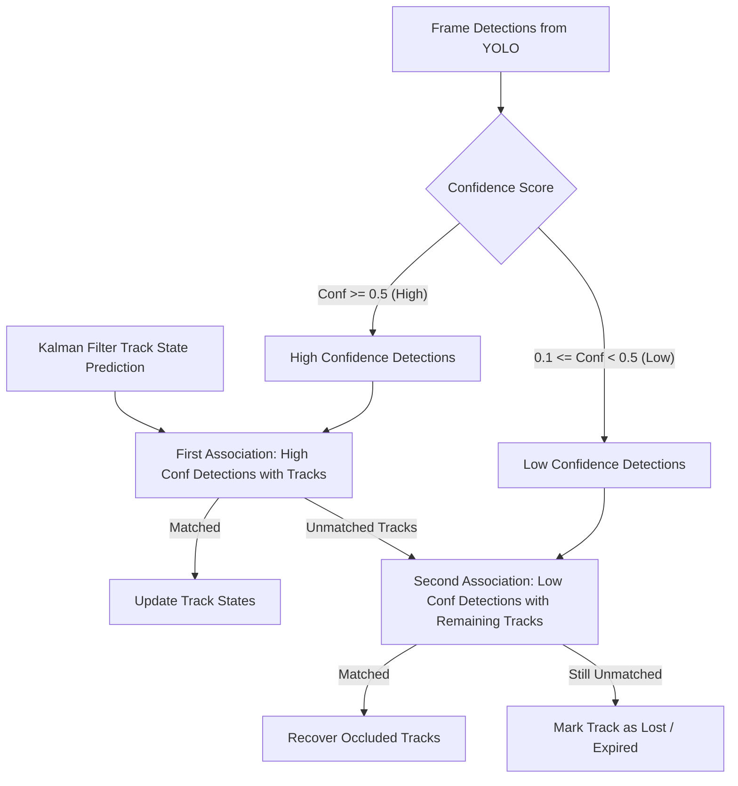

# 12. Vehicle Tracking

## 1. Tracking Objectives
Vehicle detection alone cannot measure speed, stationary duration, or direction of travel. Multi-object tracking (MOT) associates bounding boxes across successive video frames, producing temporal trajectories (tracklets) identified by unique integer IDs.

## 2. Tracking Architecture: ByteTrack & Centroid Kalman Association

## 3. Tracking Algorithm Specifications

### 3.1 State Vector Representation
For each vehicle $i$, the Kalman filter maintains an 8-dimensional state vector:
$$\mathbf{x} = [x_c, y_c, a, h, \dot{x}_c, \dot{y}_c, \dot{a}, \dot{h}]^T$$
Where $(x_c, y_c)$ is the bounding box center, $a = w/h$ is the aspect ratio, $h$ is height, and their respective time derivatives represent velocities.

### 3.2 Association Metric
- Primary: Intersection over Union (IoU) between predicted Kalman bounding box and detected bounding box.
- Cost matrix solved using the Hungarian algorithm (`scipy.optimize.linear_sum_assignment`).
- Distance threshold: $\text{IoU}_{\text{threshold}} = 0.3$.

### 3.3 Trajectory History & Speed Estimation
- Rolling FIFO window of up to 30 frame centroids: $\mathcal{T}_i = \{(x_t, y_t, \tau_t)\}_{t=0}^k$.
- Pixel displacement $\Delta d_{\text{px}} = \sqrt{(x_k - x_0)^2 + (y_k - y_0)^2}$.
- Calibrated metric displacement: $\Delta d_{\text{meters}} = \Delta d_{\text{px}} \times s_{\text{scale}}$ where $s_{\text{scale}}$ is derived from camera calibration.
- Instantaneous Speed:
  $$v_i = \left(\frac{\Delta d_{\text{meters}}}{\Delta t}\right) \times 3.6 \quad [\text{km/h}]$$
- Stationary Classification: If $v_i < 3.0 \text{ km/h}$ for $\Delta t > 3.0 \text{ seconds}$, vehicle $i$ is flagged as `IS_STATIONARY`.
