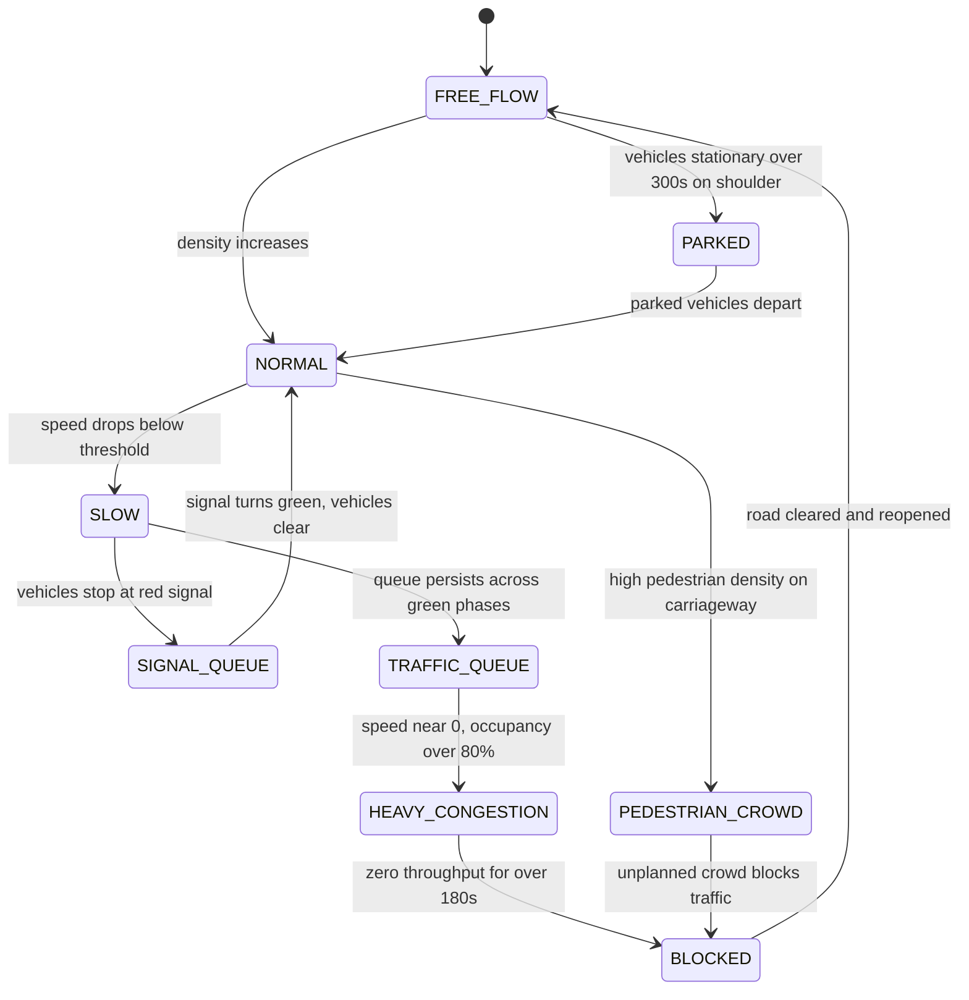
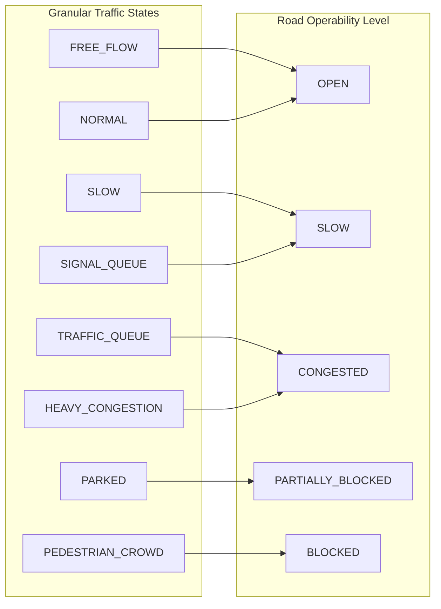

# 13. Traffic State Engine

## 1. Architectural Distinction: Detection vs. Traffic State
> [!IMPORTANT]
> **Fundamental Principle:** Vehicle detection $\neq$ Traffic detection.
> A frame containing 40 stationary vehicles is not automatically a traffic jam—it could be a normal red light queue waiting for a green signal, or vehicles lawfully parked on a road shoulder. The Traffic State Engine interprets extracted kinematic and spatial features over time to deduce systemic road condition.

## 2. Traffic State Enumeration

| State Name | Color Code | Description | Typical Real-World Scenario |
| :--- | :--- | :--- | :--- |
| `FREE_FLOW` | Green | High average speed, low road density, minimal stops. | Late-night arterial, open highway. |
| `NORMAL` | Emerald | Moderate steady speed, safe inter-vehicle headway. | Standard midday traffic conditions. |
| `SLOW` | Amber | Speed significantly below posted limit, dense platoon. | Heavy peak hour, narrow road bottleneck. |
| `SIGNAL_QUEUE` | Yellow | Vehicles stationary at intersection while signal is RED, moving promptly once GREEN. | Normal cyclic junction pause. |
| `TRAFFIC_QUEUE` | Orange | Vehicle line extending beyond intersection spillover, persisting across green phases. | Inadequate green cycle, minor bottleneck. |
| `HEAVY_CONGESTION`| Red | Average speed $< 5\text{ km/h}$, density $>80\%$, stationary ratio $>70\%$ without signal justification. | Severe gridlock, downstream blockage. |
| `PARKED` | Gray | Vehicles stationary $>300\text{ s}$ outside primary travel lanes (shoulders/bays). | On-street parking, taxi stands. |
| `PEDESTRIAN_CROWD`| Purple | High density of pedestrian detections on carriageway; vehicular flow halted or diverted. | Protest rally, religious procession, fair. |

## 3. Road Operability Mapping
From the granular traffic states, the higher-level Road Operability is derived for graph routing:
- **`OPEN`**: States `FREE_FLOW`, `NORMAL`.
- **`SLOW`**: States `SLOW`, `SIGNAL_QUEUE`.
- **`CONGESTED`**: States `TRAFFIC_QUEUE`, `HEAVY_CONGESTION`.
- **`PARTIALLY_BLOCKED`**: State `PARKED` obstructing travel lanes, or low-density road work.
- **`BLOCKED`**: State `PEDESTRIAN_CROWD` (unplanned protest) or zero throughput with infinite queue persistence ($t_{\text{persist}} > 180\text{ s}$ and $\bar{v} \approx 0$).

## 4. State Transition Diagram

## 5. Road Operability Mapping Flow

