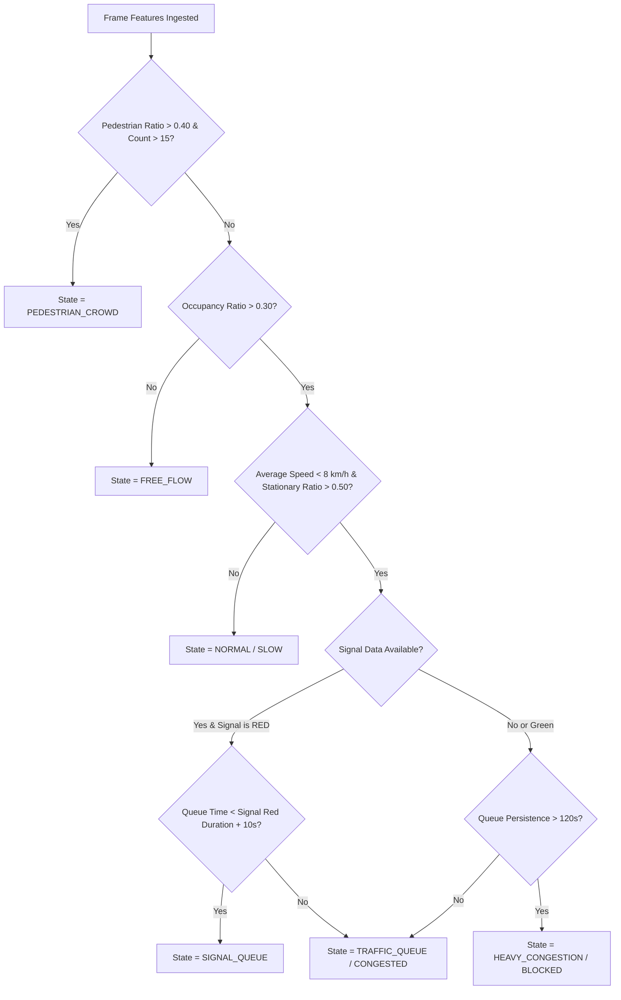

# 14. Queue and Congestion Detection

## 1. Feature Formulations

### 1.1 Road Area Occupancy Ratio ($\rho_{\text{occ}}$)
Let $\mathcal{A}_{\text{ROI}}$ be the pixel area of the defined drivable road polygon. For $N$ detected vehicles inside the polygon with bounding box areas $a_i = w_i \times h_i$:
$$\rho_{\text{occ}} = \min\left(1.0, \, \frac{\sum_{i=1}^N (a_i \cap \mathcal{A}_{\text{ROI}})}{\mathcal{A}_{\text{ROI}}}\right)$$

### 1.2 Stationary Fraction ($r_{\text{stat}}$)
Let $N_{\text{stat}}$ be the count of vehicles tracked inside the ROI with speed $v_i \le v_{\text{threshold}}$ ($3 \text{ km/h}$):
$$r_{\text{stat}} = \frac{N_{\text{stat}}}{\max(1, N_{\text{total}})}$$

### 1.3 Queue Persistence Duration ($t_{\text{persist}}$)
Queue persistence measures the unbroken time window (in seconds) during which $r_{\text{stat}} \ge 0.60$ and $N_{\text{total}} \ge N_{\text{min\_queue}}$:
$$t_{\text{persist}} = t_{\text{current}} - t_{\text{queue\_start}}$$
If the queue dissipates for more than 5 consecutive seconds, $t_{\text{persist}}$ resets to zero.

## 2. Decision Logic Tree

## 3. Explaining Queue vs. Congestion in Viva
1. **Signal Queue:** Cyclic, expected, self-clearing when green light appears. The queue length decreases from front to back during the green phase.
2. **Traffic Congestion Queue:** Persistent, non-clearing across multiple cycles; tail of the queue grows faster than head can discharge.
3. **Parked Non-Traffic:** Spatial clustering on curbside ROI without vehicle headways changing over several minutes.
