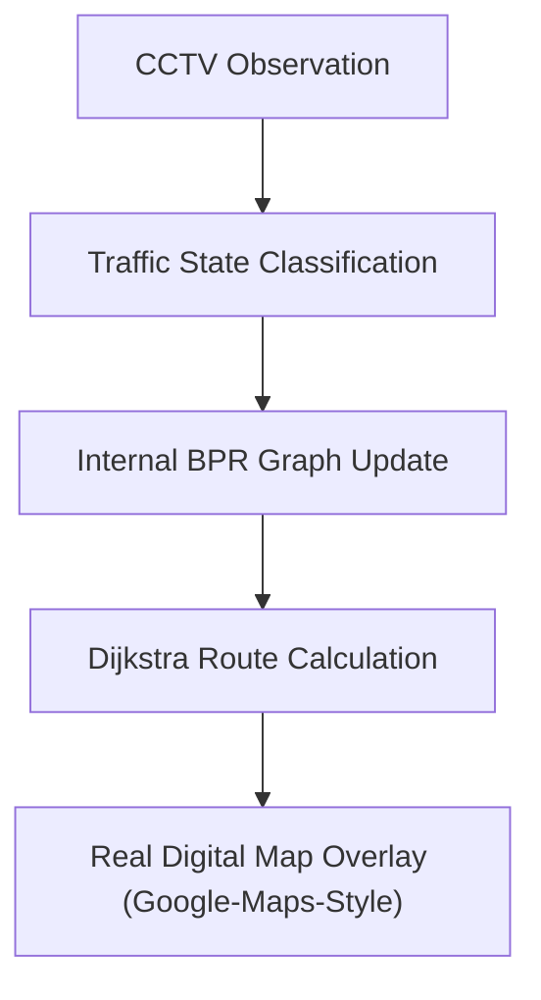

# 15. Road Graph Jigsaw Engine

## 1. Graph Theoretical Representation
The urban road network is modeled as a weighted directed multigraph $G = (V, E)$:
- **Vertices ($V$):** Physical road intersections and major decision junctions:
  $$V = \{v_1, v_2, \dots, v_n\}$$
  Each vertex possesses geographical or grid coordinates: $v_i = (\text{id}, \text{name}, x, y, \text{type})$.
- **Directed Edges ($E$):** Drivable road segments connecting junctions:
  $$e_k = (u, v, k) \in E \quad \text{where } u, v \in V$$
  Edge attributes include:
  $$\text{attr}(e_k) = \{\text{road\_id}, \text{length\_m}, \text{lanes}, \text{capacity\_vph}, v_{\text{free}}, \rho(t), \bar{v}(t), \text{status}\}$$

## 2. The Jigsaw Puzzle Metaphor in Graph Theory
In a classic jigsaw puzzle, every interlocking piece must fit to maintain structural continuity. In urban traffic:
1. Each road segment $e_k$ is an active "puzzle piece" carrying dynamic vehicle flow $q(e_k)$.
2. When an edge is declared `BLOCKED` (e.g., due to an accident or protest on $e_{\text{blocked}}$), that piece is conceptually **removed from the puzzle**.
3. Removing $e_{\text{blocked}}$ creates an impedance void: the cost of traversing $e_{\text{blocked}}$ becomes:
   $$W(e_{\text{blocked}}) = \infty$$
4. The volume $q(e_{\text{blocked}})$ formerly carried by the disabled link cannot vanish; it must be assembled into neighboring puzzle pieces (parallel corridors) without exceeding their structural capacities.

```
       [Junction 1] ───(Road R1: Open)───► [Junction 2]
            │                                   │
      (Road R4: Open)                    (Road R2: Heavy)
            │                                   ▼
            ▼                            [Junction 4]
       [Junction 3] ───[Road R3: BLOCKED]───► (Missing Piece)
                         (Detour diverted via R4 & R5)
```

## 4. Internal Engine vs. Real Map UI Distinction
It is critical to distinguish between **internal graph computation** and **user interface presentation**:

- **Internal Backend Graph ($G=(V,E)$):** NetworkX and Python algorithms represent roads as abstract nodes and edges with dynamic BPR impedance weights ($W(e)$). Pathfinding (Dijkstra / Yen's K-Shortest) calculates:
  $$\text{Start} \to A \to B \to E \to H \to \text{Destination}$$
- **User-Facing Presentation (Real Digital Map):** The user does **not** see an abstract node graph or puzzle shapes. Instead, the UI renders a **real digital road map** (Google-Maps-like vector navigation canvas):
  - 🟢 **Green Road:** Normal / Recommended route.
  - 🟡 **Yellow Road:** Slow traffic flow.
  - 🔴 **Red Road:** Congested bottleneck corridor.
  - ⚫ **Black Road / 🚧:** Disabled / Blocked segment.
  - 📍 **Start & Destination Pins:** Origin and target junctions.
  - ➡️ **Highlighted Route:** Overlaid path showing the newly computed optimal detour.


