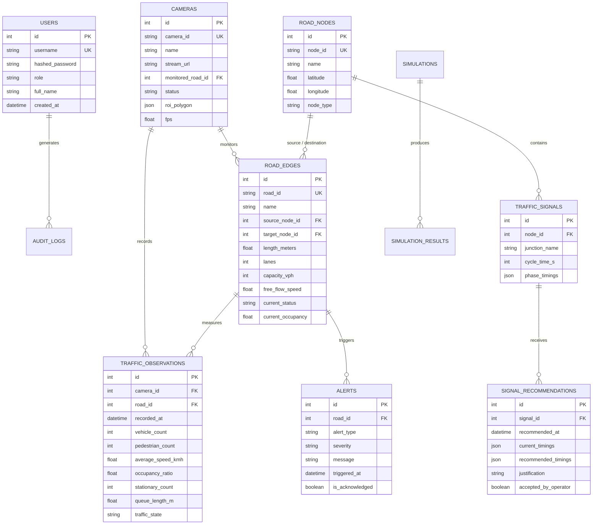

# 19. Database Design

## 1. Relational Schema Architecture
The Crowd Flow database stores user credentials, road network topology, camera calibration mappings, time-series telemetry observations, alert records, and simulation runs.

## 2. Entity Relationship (ER) Diagram

## 3. Database Indexes for Performance
- `idx_obs_road_time`: Composite index on `TRAFFIC_OBSERVATIONS(road_id, recorded_at DESC)` for fast dashboard graph queries.
- `idx_alerts_active`: Index on `ALERTS(is_acknowledged, triggered_at DESC)` for real-time notification feeds.
- `idx_road_status`: Index on `ROAD_EDGES(current_status)` for instant graph impedance compilation.
