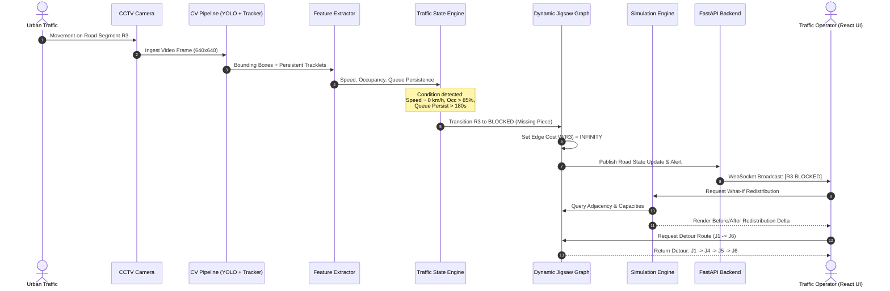

# 26. Data Flow

## 1. End-to-End System Data Flow
The sequence below illustrates the life of a data frame from photon arrival at the CCTV lens to the generation of an advisory detour on the operator screen.

