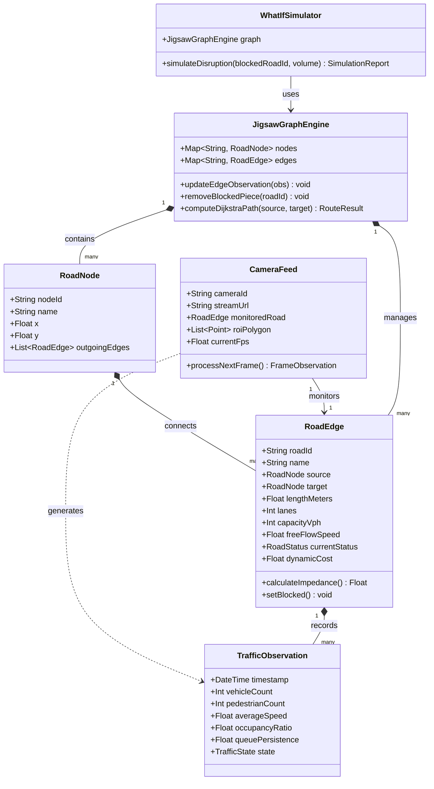
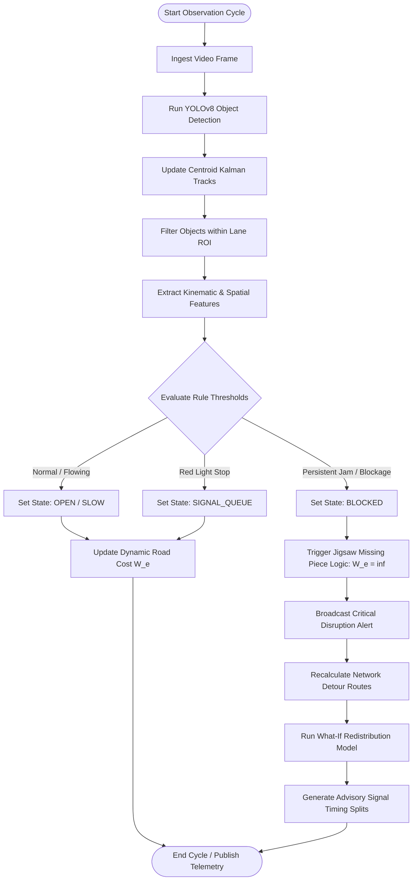

# 27. UML Diagram Specification

## 1. Class Diagram (Core Backend Domain)

```mermaid
classDiagram
    class RoadNode {
        +String nodeId
        +String name
        +Float x
        +Float y
        +List~RoadEdge~ outgoingEdges
    }

    class RoadEdge {
        +String roadId
        +String name
        +RoadNode source
        +RoadNode target
        +Float lengthMeters
        +Int lanes
        +Int capacityVph
        +Float freeFlowSpeed
        +RoadStatus currentStatus
        +Float dynamicCost
        +calculateImpedance() Float
        +setBlocked() void
    }

    class CameraFeed {
        +String cameraId
        +String streamUrl
        +RoadEdge monitoredRoad
        +List~Point~ roiPolygon
        +Float currentFps
        +processNextFrame() FrameObservation
    }

    class TrafficObservation {
        +DateTime timestamp
        +Int vehicleCount
        +Int pedestrianCount
        +Float averageSpeed
        +Float occupancyRatio
        +Float queuePersistence
        +TrafficState state
    }

    class JigsawGraphEngine {
        +Map~String, RoadNode~ nodes
        +Map~String, RoadEdge~ edges
        +updateEdgeObservation(obs) void
        +removeBlockedPiece(roadId) void
        +computeDijkstraPath(source, target) RouteResult
    }

    class WhatIfSimulator {
        +JigsawGraphEngine graph
        +simulateDisruption(blockedRoadId, volume) SimulationReport
    }

    RoadNode "1" *-- "many" RoadEdge : connects
    CameraFeed "1" --> "1" RoadEdge : monitors
    CameraFeed ..> TrafficObservation : generates
    RoadEdge "1" *-- "many" TrafficObservation : records
    JigsawGraphEngine "1" *-- "many" RoadNode : contains
    JigsawGraphEngine "1" *-- "many" RoadEdge : manages
    WhatIfSimulator --> JigsawGraphEngine : uses
```

## 2. Activity Diagram: Disruption Detection & Advisory Generation

```mermaid
flowchart TD
    A([Start Observation Cycle]) --> B[Ingest Video Frame]
    B --> C[Run YOLOv8 Object Detection]
    C --> D[Update Centroid Kalman Tracks]
    D --> E[Filter Objects within Lane ROI]
    E --> F[Extract Kinematic & Spatial Features]
    F --> G{Evaluate Rule Thresholds}
    G -- Normal / Flowing --> H[Set State: OPEN / SLOW]
    G -- Red Light Stop --> I[Set State: SIGNAL_QUEUE]
    G -- Persistent Jam / Blockage --> J[Set State: BLOCKED]
    H --> K[Update Dynamic Road Cost W_e]
    I --> K
    J --> L[Trigger Jigsaw Missing Piece Logic: W_e = inf]
    L --> M[Broadcast Critical Disruption Alert]
    M --> N[Recalculate Network Detour Routes]
    N --> O[Run What-If Redistribution Model]
    O --> P[Generate Advisory Signal Timing Splits]
    K --> Q([End Cycle / Publish Telemetry])
    P --> Q
```
